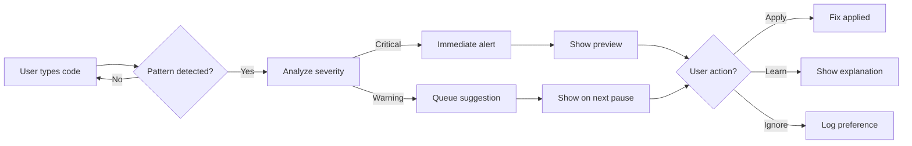

# User Experience Design - Intelligent Proactive System
## AI Buddy v2.0

**Document Version:** 1.0  
**Date:** January 2025  
**Status:** Draft

---

## 1. Design Philosophy

### Core Principles
1. **Non-Intrusive**: Suggestions should never block workflow
2. **Contextual**: Right information at the right time
3. **Actionable**: Every suggestion includes a clear action
4. **Progressive**: Advanced features revealed gradually
5. **Respectful**: Honor user preferences and focus time

---

## 2. User Interface Components

### 2.1 Terminal Notification System

#### Visual Design
```
┌─────────────────────────────────────────────────────────────┐
│ 🔔 AI Buddy Alert                                     [✕]   │
├─────────────────────────────────────────────────────────────┤
│ 🔴 Security Issue Detected                                  │
│                                                             │
│ Hardcoded password found in auth.py:42                     │
│                                                             │
│ 💡 Suggestion: Use environment variable instead             │
│                                                             │
│ Actions: [Preview Fix] [Apply] [Ignore] [Learn More]        │
└─────────────────────────────────────────────────────────────┘
```

#### Notification Levels
- 🔴 **Critical**: Security issues, data loss risks
- 🟡 **Warning**: Deprecated APIs, performance issues  
- 🟢 **Info**: Best practices, optimization tips
- 🔵 **Learning**: Educational content, examples

#### Interaction Patterns
- **Keyboard shortcuts**: 
  - `p` - Preview fix
  - `a` - Apply fix
  - `i` - Ignore
  - `l` - Learn more
  - `Esc` - Dismiss
- **Auto-dismiss**: Info level after 10s, others persistent
- **Stacking**: Multiple notifications stack vertically

### 2.2 Fix Preview Interface

#### Layout
```
┌─────────────────────────────────────────────────────────────┐
│ 🔧 Fix Preview: Hardcoded Password                         │
├─────────────────────────────────────────────────────────────┤
│ File: /src/auth.py                                         │
├─────────────────────────────────────────────────────────────┤
│ ─ Before ──────────────────────────────────────────────────│
│ 40 │ def authenticate(username):                            │
│ 41 │     # Check credentials                                │
│ 42 │     password = "admin123"  ← Issue here              │
│ 43 │     return check_password(username, password)         │
├─────────────────────────────────────────────────────────────┤
│ + After ───────────────────────────────────────────────────│
│ 40 │ def authenticate(username):                            │
│ 41 │     # Check credentials                                │
│ 42 │     password = os.getenv('ADMIN_PASSWORD')  ✓ Fixed  │
│ 43 │     return check_password(username, password)         │
├─────────────────────────────────────────────────────────────┤
│ 📝 Additional Actions Required:                             │
│ • Add ADMIN_PASSWORD=your_password to .env file           │
│ • Ensure .env is in .gitignore                            │
├─────────────────────────────────────────────────────────────┤
│ [Apply Fix] [Modify] [Cancel]                 Confidence: 95%│
└─────────────────────────────────────────────────────────────┘
```

### 2.3 Buddy Chat UI Enhancements

#### New Commands
```
AI Buddy Commands (v2.0):
  • suggestions     - View active suggestions
  • apply <id>      - Apply a specific fix
  • learn <topic>   - Get educational content
  • preferences     - Configure notification settings
  • stats          - View improvement statistics
  • snooze <time>  - Pause notifications
```

#### Enhanced Suggestion View
```
📋 Active Suggestions (3)
════════════════════════════════════════════════════════════

1. 🔴 [CRITICAL] Security Issue
   Hardcoded password in auth.py:42
   💡 Use environment variable instead
   
   Actions: preview 1 | apply 1 | ignore 1
   
2. 🟡 [WARNING] Deprecated API
   requests.get() using old parameter 'verify=False'
   💡 Update to use secure connection
   
   Actions: preview 2 | apply 2 | docs 2
   
3. 🟢 [INFO] Performance Optimization
   List comprehension can replace loop in utils.py:78
   💡 30% faster execution
   
   Actions: preview 3 | benchmark 3 | ignore 3

════════════════════════════════════════════════════════════
Type 'help <number>' for detailed explanation
```

### 2.4 Status Indicators

#### Code Quality Meter
```
Code Quality: ████████░░ 82% ↑2%
             
Issues:  🔴 0  🟡 2  🟢 5
API Status: ✓ All up to date
Test Coverage: 78% (target: 80%)
```

#### Real-time Feedback
```
[10:32:15] ✓ Error pattern detected and prevented
[10:32:18] 📚 Documentation verified for requests.post()
[10:32:22] 💡 Better approach available (view suggestion)
[10:32:30] ✅ Applied fix for deprecated API usage
```

---

## 3. User Workflows

### 3.1 Error Prevention Flow



### 3.2 Learning Mode Flow

1. User encounters new API/pattern
2. System detects learning opportunity
3. Contextual hint appears
4. User can:
   - Expand for full explanation
   - See examples
   - Access documentation
   - Try interactive tutorial

### 3.3 Batch Fix Flow

When multiple similar issues detected:
```
┌─────────────────────────────────────────────────────────────┐
│ 🔧 Batch Fix Available                                      │
├─────────────────────────────────────────────────────────────┤
│ Found 5 instances of hardcoded credentials                  │
│                                                             │
│ Files affected:                                             │
│ • auth.py (2 instances)                                     │
│ • config.py (1 instance)                                    │
│ • test_utils.py (2 instances)                              │
│                                                             │
│ [Preview All] [Fix All] [Fix Individual] [Cancel]          │
└─────────────────────────────────────────────────────────────┘
```

---

## 4. Notification Management

### 4.1 Smart Timing
- Detect natural pauses (no typing for 3s)
- Respect focus modes
- Batch related issues
- Priority-based queuing

### 4.2 User Preferences
```yaml
preferences:
  notifications:
    critical: always
    warning: on_pause
    info: batched
    learning: on_demand
  
  quiet_hours:
    enabled: true
    start: "22:00"
    end: "08:00"
  
  focus_mode:
    enabled: false
    break_for_critical: true
  
  auto_apply:
    security_fixes: true
    formatting: true
    performance: false
```

---

## 5. Visual Design System

### 5.1 Color Palette
- **Critical**: #DC3545 (Red)
- **Warning**: #FFC107 (Amber)
- **Success**: #28A745 (Green)
- **Info**: #17A2B8 (Cyan)
- **Background**: #1E1E1E (Dark)
- **Text**: #E0E0E0 (Light Gray)

### 5.2 Typography
- **Headers**: Bold, +2 size
- **Code**: Monospace, syntax highlighted
- **Actions**: Underlined, interactive
- **Descriptions**: Regular, 80% opacity

### 5.3 Icons
- 🔴 Critical issues
- 🟡 Warnings
- 🟢 Info/Success
- 💡 Suggestions
- 🔧 Fixes available
- 📚 Documentation
- ✓ Applied/Resolved
- ⚡ Performance
- 🔒 Security
- 🎯 Best practice

---

## 6. Accessibility

### 6.1 Keyboard Navigation
- All actions keyboard accessible
- Tab order follows visual hierarchy
- Escape always dismisses
- Shortcuts documented

### 6.2 Screen Reader Support
- Semantic terminal output
- ARIA-like annotations
- Descriptive action labels
- Status announcements

### 6.3 Customization
- Font size adjustable
- High contrast mode
- Reduced motion option
- Simple text mode

---

## 7. Mobile/Remote Considerations

### 7.1 SSH Session Support
- Lightweight notification mode
- Text-only fallbacks
- Reduced bandwidth usage
- Persistent suggestion queue

### 7.2 Responsive Layouts
- Adapt to terminal width
- Stackable notifications
- Collapsible sections
- Simplified previews

---

## 8. Metrics & Analytics

### 8.1 User Dashboard
```
AI Buddy Statistics - Last 30 Days
═══════════════════════════════════════════════════════

Errors Prevented:       47 🎯
Suggestions Applied:    38/52 (73%)
Time Saved:            ~3.2 hours
Code Quality:          ↑ 15%

Top Improvements:
1. Security fixes:     12 applied
2. API updates:        8 applied  
3. Performance:        6 applied

Learning Progress:
• Python best practices:    ████████░░ 85%
• Security awareness:       ██████░░░░ 65%
• Testing patterns:         ████░░░░░░ 45%

[View Detailed Report] [Export Stats] [Share Progress]
```

### 8.2 Feedback Collection
- One-click helpful/not helpful
- Optional detailed feedback
- Suggestion effectiveness tracking
- Pattern learning from dismissals

---

## 9. Onboarding Experience

### 9.1 First Run
```
Welcome to AI Buddy v2.0! 🎉

New intelligent features:
✓ Real-time error prevention
✓ API documentation lookup  
✓ Automatic fix generation

Quick Setup:
1. Choose notification style: [Minimal] [Standard] [Detailed]
2. Set intervention level: [Conservative] [Balanced] [Proactive]
3. Enable features: [✓] Security [✓] Performance [✓] Best Practices

[Start Tour] [Skip to Default] [Customize]
```

### 9.2 Progressive Disclosure
- Start with critical issues only
- Gradually introduce more features
- Learn user preferences
- Adapt to coding style

---

## 10. Error States & Edge Cases

### 10.1 Offline Mode
```
⚠️ AI Buddy: Limited Mode
Documentation lookup unavailable (offline)
Using cached patterns for analysis
[Retry Connection] [Continue Offline]
```

### 10.2 Rate Limiting
```
⏸️ AI Buddy: Cooling Down
Too many suggestions in short time
Resuming in 30 seconds...
[View Queued] [Adjust Settings]
```

### 10.3 Conflicting Fixes
```
⚠️ Multiple Solutions Available

2 different approaches found:
1. Environment variable (Recommended)
2. Config file approach

[Compare Solutions] [Choose Default]
```

---

## Document History
- v1.0 - Initial UX design document (January 2025)